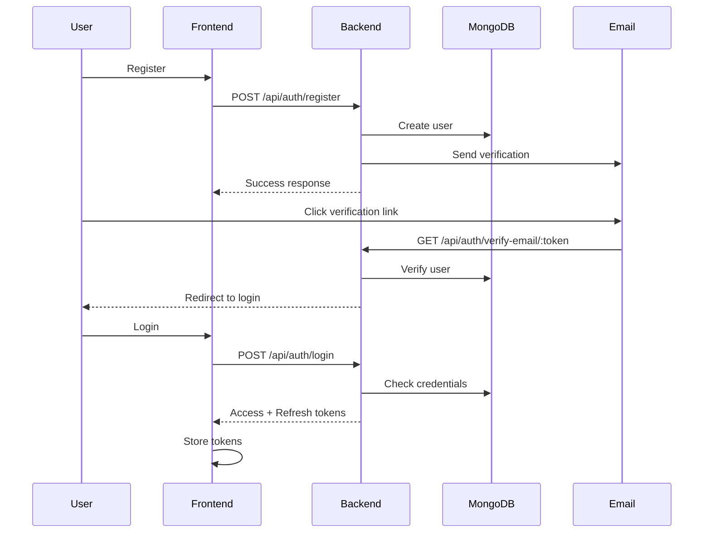
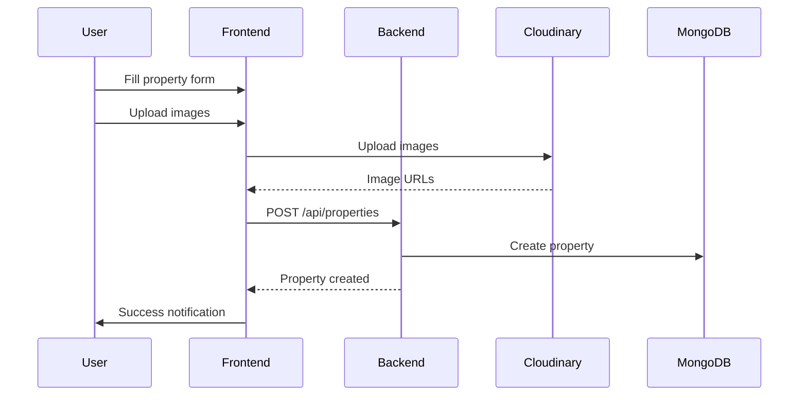

<div align="center">

# 🏠 Nadlan — Real Estate Platform

[](https://borisnadlan.netlify.app)

</div>

Full-featured real estate application for searching, publishing and managing property listings, with user accounts, favorites, admin panel and cloud image storage integration.

> **Important Notice**
>
> The NADLAN platform is currently under active development. Many features are still unavailable or operate in a limited mode. We are building a flexible and scalable system designed to support a wide range of real estate providers, including agencies, independent agents, and large property companies.
>
> Each provider will receive dedicated tools, customized settings, and an advanced management panel tailored to their specific needs. These capabilities will be introduced gradually as the platform evolves.
>
> We are continuously expanding the system, adding new modules, improving the user experience, and optimizing the process of publishing and promoting property listings.
>
> If a certain feature is temporarily unavailable, it is part of the ongoing development phase and will be implemented in upcoming updates.

## Project Architecture


## 📚 Documentation

<details>
<summary><b>🔍 API Documentation</b></summary>

### Authentication Flow


</details>

<details>
### Property Creation Flow



</details>

- `nadlan_back/` — backend (Node.js, Express, MongoDB)
- `nadlan_front/` — frontend (React, Vite, React Router, React Query, MUI, Tailwind)

---

## Backend (`nadlan_back`)

### Tech Stack

- Node.js, Express
- MongoDB + Mongoose
- JWT authentication + sessions + Passport Google OAuth 2.0
- Multer + Cloudinary for image upload
- Nodemailer for emails (verification, password reset, contact forms)
- Helmet, rate limiting, CORS with allowed origins
- Winston + morgan for logging

### Main server (`server.js`)

- Configures Express, Helmet, CORS, rate limiting, JSON parsing.
- Connects to MongoDB (`MONGODB_URI` / `MONGODB_URI_PROD`).
- Session management (`express-session`) with environment-aware cookie options.
- Passport (Google OAuth) and user sessions.
- Static assets: `/assets` → `nadlan_back/public`.
- Base routes:
  - `GET /` — server info and main endpoints.
  - `GET /api/health` — health check (Mongo state, latency, uptime).
- Mounted routers:
  - `/api/auth` — auth and user profile.
  - `/api/properties` — properties, favorites, reviews, contacts.
  - `/api/upload` — file/image upload.
  - `/api/admin` — admin operations.
  - `/api/cloudinary` — Cloudinary helper operations.
  - `/api/contact` — contact forms.
  - `/api` (consulting) — consulting form/service.
- 404 handler and global error handler with logging.

### Key modules

- `config/passport.js` — Passport config, Google OAuth, user serialization.
- `models/Property.js` — property schema: address, price, area, type, images, owner, favorites, reviews, drafts, etc.
- `models/User.js` — user schema: email/password, roles (user/admin), profile data, verification states, favorites, statistics, etc.

- `controllers/authController.js`:
  - Registration (`/api/auth/register`) with validation and email verification.
  - Login (`/api/auth/login`) with access/refresh tokens.
  - Refresh token (`/api/auth/refresh-token`).
  - Logout (`/api/auth/logout`).
  - Email verification (`/api/auth/verify-email/:token`).
  - Resend verification email (`/api/auth/resend-verification`).
  - Password recovery (`/api/auth/forgot-password`, `/api/auth/reset-password/:token`).
  - Get and update profile (`/api/auth/profile`, `PUT /profile`).
  - User statistics (`/api/auth/profile/stats`).
  - Delete own profile (`DELETE /api/auth/profile`).
  - Google OAuth (`/api/auth/google`, `/api/auth/google/callback`).

- `routes/auth.js` — binds all auth routes and protects them using `authenticateToken` / `requireRole`.

- `controllers/propertyController.js` via `routes/properties.js`:
  - `GET /api/properties` — search/filter properties (city, price, type, area, etc.).
  - `GET /api/properties/stats` — property statistics.
  - `GET /api/properties/mine` — listings of the current user.
  - `GET /api/properties/:id` — property details (with reviews, contacts, etc.).
  - `GET /api/properties/:id/similar` — similar properties.
  - `POST /api/properties` — create listing.
  - `POST /api/properties/draft` — save draft listing.
  - `PUT /api/properties/:id` — update listing.
  - `DELETE /api/properties/:id` — delete listing.
  - Favorites:
    - `GET /api/properties/user/favorites` — favorites list.
    - `POST /api/properties/:id/favorites` — add to favorites.
    - `DELETE /api/properties/:id/favorites` — remove from favorites.
  - Reviews and contacts:
    - `POST /api/properties/:id/reviews` — add review.
    - `POST /api/properties/:id/contacts` — send contact request.
  - Image upload:
    - `POST /api/properties/upload-images` — upload images via Multer + Cloudinary.

- `middleware/validation.js` — Joi-based validation for registration/login, profile, properties, search filters, ObjectId.
- `middleware/auth.js` — JWT check (`authenticateToken`), optional auth, role checks.
- `middleware/upload.js` — property image upload and processing.
- `middleware/error.js` — requestId, error logging, CORS errors.
- `utils/emailService.js` — email sending (verification, password reset, contact/consulting forms).
- `utils/logger.js` — Winston logger config and morgan integration.
- `scripts/*.mjs` — helper scripts: seeding properties, testing SMTP, clearing favorites, etc.

### Backend environment variables

Approximate `nadlan_back/.env` example (adjust to your needs):

```bash
NODE_ENV=development
PORT=3000

MONGODB_URI=mongodb://localhost:27017/nadlan
MONGODB_URI_PROD=...

SESSION_SECRET=super-secret-session-key

JWT_ACCESS_SECRET=your-access-secret
JWT_REFRESH_SECRET=your-refresh-secret
JWT_ACCESS_EXPIRES=15m
JWT_REFRESH_EXPIRES=7d

CLIENT_ORIGIN=http://localhost:5173

RATE_LIMIT_WINDOW_MS=900000
RATE_LIMIT_MAX_REQUESTS=100

SMTP_HOST=smtp.example.com
SMTP_PORT=587
SMTP_USER=your-user
SMTP_PASS=your-pass
SMTP_FROM="Nadlan <no-reply@example.com>"

CLOUDINARY_CLOUD_NAME=...
CLOUDINARY_API_KEY=...
CLOUDINARY_API_SECRET=...
```

---

## Frontend (`nadlan_front`)

### Tech Stack

- React 18 + Vite
- React Router v6
- React Query (TanStack Query)
- React Hook Form + Joi/Zod
- Material UI (MUI) + Tailwind CSS + custom UI components
- React Hot Toast
- React Select, React Dropzone, Lucide icons, etc.

### Structure and main features

- `src/App.jsx` — root application component:
  - Router with routes for all pages: home, property catalog, details, login/register, profile, favorites, my listings, admin panel, legal pages, help/FAQ, consulting, support chat, etc.
  - Context providers: `ThemeProvider`, `AuthProvider`.
  - `QueryClientProvider` for React Query.
  - Global `Toaster`, `CookieBanner`, `ScrollToTop`, `ScrollToTopButton`.

- `context/AuthContext.jsx` — frontend auth state:
  - Stores user/token, loading and error states.
  - Login/logout/register/update profile via backend API.
  - Handles Google OAuth results (`/auth/success`, `/auth/error`).

- `context/ThemeContext.jsx` — theme toggle (light/dark), stored in `localStorage`.

- `components/PrivateRoute.jsx` — guards private routes (e.g. profile).

- Layout components: `components/layout/Layout.jsx`, `Header.jsx`, `Footer.jsx`.

- `components/ui/*` (Button, Card, Badge, CityAutocomplete, CloudinaryUploadWidget, etc.):
  - Shared UI elements, forms, city autocomplete, Cloudinary image upload widget.

- `pages/*`:
  - `HomePage` — landing with promo blocks and quick search.
  - `PropertiesPage` — property catalog with filters/search.
  - `PropertyDetailsPage` — property details: photos, parameters, contacts, reviews, similar listings.
  - `LoginPage` / `RegisterPage` — auth pages, including Google OAuth.
  - `ProfilePage` — user profile and statistics.
  - `MyListingsPage` — user-created listings.
  - `CreatePropertyPage` — create/edit listings, upload photos, save drafts.
  - `FavoritesPage` — favorite properties.
  - `AdminPage` — admin interface (management of users/listings).
  - Legal & info pages: `PrivacyPolicyPage`, `TermsOfServicePage`, `CookiePolicyPage`, `AboutPage`, `ContactPage`, `HelpCenterPage`, `FAQPage`, `ReportProblemPage`.
  - `SupportChatPage` — support/consulting chat.
  - `ConsultingPage` — consulting request page (integrated with `/api/consulting`).
  - Email-related pages: `EmailVerificationPage`, `ForgotPasswordPage`, `ResetPasswordPage`, `AuthSuccessPage`, `AuthErrorPage`.

- `services/api.js` — axios-based API client:
  - Methods for auth, profile, properties, favorites, reviews, contacts, consulting and more.

- `hooks/usePropertyValidation.js`, `validation/*` — validation schemas and helpers for auth and property forms.

### Frontend environment variables

Vite requires variables to start with `VITE_`.

Example `nadlan_front/.env`:

```bash
VITE_API_BASE_URL=http://localhost:3000/api
VITE_GOOGLE_CLIENT_ID=...
VITE_CLOUDINARY_CLOUD_NAME=...
VITE_CLOUDINARY_UPLOAD_PRESET=...
```

---

## Installation and Running

### Requirements

- Node.js (LTS 18+)
- npm
- Local or cloud MongoDB instance

### 1. Clone repository

```bash
git clone <YOUR_REPO_URL>
cd NADLAN
```

### 2. Backend setup

```bash
cd nadlan_back
cp .env.example .env   # if exists
# edit .env and fill Mongo, JWT, SMTP, Cloudinary, etc.

npm install
npm run dev             # run with nodemon
# or
npm start               # run plain node server
```

By default the server runs on port `3000` (or the next available). Health check: `http://localhost:3000/api/health`.

### 3. Frontend setup

In a new terminal:

```bash
cd nadlan_front
cp .env.example .env   # if exists
# set VITE_API_BASE_URL to backend URL

npm install
npm run dev
```

Vite dev server is available at `http://localhost:5173` by default.

### 4. Typical dev workflow

- Run backend (`nadlan_back`) and frontend (`nadlan_front`) in two separate terminals.
- Ensure `CLIENT_ORIGIN` (backend) and `VITE_API_BASE_URL` (frontend) are configured to point to each other.

---

## Main User Features

- User registration, login, logout, password recovery, email verification.
- Google login (OAuth 2.0).
- User profile and basic statistics.
- Create, edit and delete real estate listings; drafts support.
- Property image uploads (Cloudinary).
- Favorites list for properties.
- Reviews and contact requests for properties.
- Rich search and filtering (city, price, type, etc.).
- Help, FAQ, bug report, consulting and support chat pages.
- Admin panel for extended system management.


## 🌟 Acknowledgments
Built With Amazing Technologies
React - UI Library
Node.js - Runtime
Express - Web Framework
MongoDB - Database
Cloudinary - Media Management
Material-UI - Component Library
Tailwind CSS - Utility CSS
Vite - Build Tool
And many other amazing open-source projects! 🙏

<div align="center">

### ⭐ Star Us on GitHub!

If you find this project useful, please consider giving it a star ⭐

[](https://github.com/boris2024-spec/NADLAN/stargazers)

Made with ❤️ by the Nadlan Team

[🔝 Back to Top](#-nadlan--real-estate-platform)

</div>