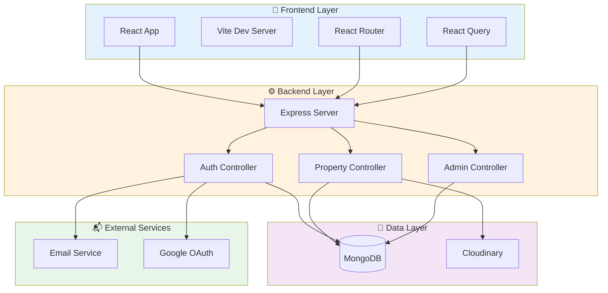
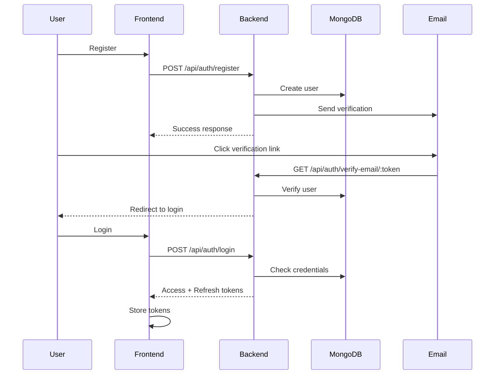
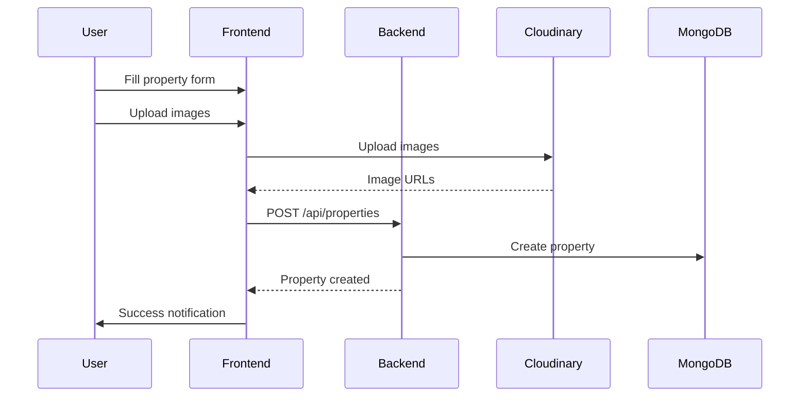

<div align="center">

# 🏠 Nadlan — Real Estate Platform

[](https://borisnadlan.netlify.app)
[](https://borisnadlan.netlify.app/terms-of-service)
[](https://borisnadlan.netlify.app/privacy-policy)

**Full-featured real estate application for searching, publishing and managing property listings**

[🚀 Features](#-features) • [🏗️ Architecture](#️-architecture) • [⚙️ Installation](#️-installation) • [📚 Documentation](#-documentation)

</div>

---

## 📢 Important Notice

> 🚧 **Active Development Phase**
>
> The NADLAN platform is evolving rapidly with new features being added continuously. We're building a flexible and scalable ecosystem for real estate providers including agencies, independent agents, and property companies.
>
> 🎯 **What's Coming:**
> - 🔧 Dedicated provider management tools
> - ⚙️ Customized settings per provider type
> - 📊 Advanced analytics dashboard
> - 🔔 Real-time notifications
> - 💬 Enhanced communication features
>
> Some features may be temporarily limited as we continue development.

---

## 🚀 Features

<table>
<tr>
<td width="50%">

### 👤 User Features
- ✅ Registration & Authentication
- 🔐 JWT + Google OAuth 2.0
- 📧 Email verification
- 🔑 Password recovery
- 👤 User profiles & statistics
- ⭐ Favorites system
- 💬 Reviews & ratings
- 📞 Contact requests

</td>
<td width="50%">

### 🏢 Property Management
- ➕ Create/Edit listings
- 📸 Image uploads (Cloudinary)
- 💾 Draft support
- 🔍 Advanced search & filters
- 🏘️ City autocomplete
- 📊 Property statistics
- 🔗 Similar listings
- 🗺️ Interactive maps (coming)

</td>
</tr>
<tr>
<td width="50%">

### 🛡️ Admin Panel
- 👥 User management
- 🏠 Property moderation
- 📊 Analytics dashboard
- 🔧 System configuration
- 📝 Content management

</td>
<td width="50%">

### 🎨 UX/UI
- 🌓 Dark/Light theme
- 📱 Responsive design
- ⚡ Fast performance
- 🍪 Cookie management
- 💡 Help & FAQ
- 🐛 Bug reporting

</td>
</tr>
</table>

---

## 🏗️ Architecture

<details>
<summary><b>📐 Click to view system architecture diagram</b></summary>



### 📁 Project Structure

```
NADLAN/
├── 🔧 nadlan_back/          # Backend (Node.js + Express)
│   ├── config/              # Configuration files
│   ├── controllers/         # Business logic
│   ├── middleware/          # Auth, validation, upload
│   ├── models/              # MongoDB schemas
│   ├── routes/              # API endpoints
│   ├── utils/               # Helpers & services
│   └── server.js            # Entry point
│
└── 🎨 nadlan_front/         # Frontend (React + Vite)
    ├── src/
    │   ├── components/      # Reusable components
    │   ├── context/         # React Context
    │   ├── hooks/           # Custom hooks
    │   ├── pages/           # Route pages
    │   ├── services/        # API services
    │   └── utils/           # Helpers
    └── vite.config.js       # Vite configuration
```

</details>

---

## 🔧 Backend (`nadlan_back`)

<details open>
<summary><b>📦 Tech Stack</b></summary>

| Technology | Purpose |
|------------|---------|
|  | Runtime environment |
|  | Web framework |
|  | Database |
|  | Authentication |
|  | OAuth (Google) |
|  | Image storage |
|  | Email service |

</details>

<details>
<summary><b>🛣️ API Routes Overview</b></summary>

### 🔐 Authentication (`/api/auth`)
```
POST   /register              - Register new user
POST   /login                 - Login with credentials
POST   /logout                - Logout user
POST   /refresh-token         - Refresh access token
GET    /verify-email/:token   - Verify email address
POST   /resend-verification   - Resend verification email
POST   /forgot-password       - Request password reset
POST   /reset-password/:token - Reset password
GET    /profile               - Get user profile
PUT    /profile               - Update user profile
DELETE /profile               - Delete user account
GET    /profile/stats         - User statistics
GET    /google                - Google OAuth login
GET    /google/callback       - Google OAuth callback
```

### 🏠 Properties (`/api/properties`)
```
GET    /                      - Search properties (with filters)
GET    /stats                 - Property statistics
GET    /mine                  - User's own listings
GET    /:id                   - Property details
GET    /:id/similar           - Similar properties
POST   /                      - Create new property
POST   /draft                 - Save draft
PUT    /:id                   - Update property
DELETE /:id                   - Delete property
POST   /upload-images         - Upload property images

⭐ Favorites
GET    /user/favorites        - Get favorites list
POST   /:id/favorites         - Add to favorites
DELETE /:id/favorites         - Remove from favorites

💬 Reviews & Contacts
POST   /:id/reviews           - Add review
POST   /:id/contacts          - Send contact request
```

### 🛡️ Admin (`/api/admin`)
```
GET    /users                 - List all users
GET    /users/:id             - Get user details
PUT    /users/:id             - Update user
DELETE /users/:id             - Delete user
GET    /properties            - List all properties
PUT    /properties/:id        - Update property
DELETE /properties/:id        - Delete property
```

### 📧 Other Routes
```
POST   /api/contact           - Contact form
POST   /api/consulting        - Consulting request
POST   /api/upload            - File upload
GET    /api/health            - Health check
```

</details>

<details>
<summary><b>📊 Data Models</b></summary>

### 👤 User Model
```javascript
{
  email: String (unique, required),
  password: String (hashed),
  name: String,
  phone: String,
  role: ["user", "admin"],
  isVerified: Boolean,
  verificationToken: String,
  resetPasswordToken: String,
  favorites: [PropertyId],
  googleId: String,
  avatar: String,
  createdAt: Date,
  statistics: {
    propertiesViewed: Number,
    searchesMade: Number,
    favoritesAdded: Number
  }
}
```

### 🏠 Property Model
```javascript
{
  title: String (required),
  description: String,
  price: Number (required),
  address: {
    city: String,
    street: String,
    houseNumber: String,
    apartmentNumber: String
  },
  propertyType: ["apartment", "house", "land", "commercial"],
  dealType: ["sale", "rent"],
  area: Number,
  rooms: Number,
  floor: Number,
  totalFloors: Number,
  images: [String],
  owner: UserId (required),
  status: ["active", "draft", "sold", "archived"],
  favorites: [UserId],
  reviews: [{
    user: UserId,
    rating: Number,
    comment: String,
    createdAt: Date
  }],
  contacts: [{
    name: String,
    email: String,
    phone: String,
    message: String,
    createdAt: Date
  }],
  createdAt: Date,
  updatedAt: Date
}
```

</details>

<details>
<summary><b>🔐 Security Features</b></summary>

- 🛡️ **Helmet.js** - HTTP headers security
- 🚦 **Rate Limiting** - DDoS protection
- 🔒 **JWT Tokens** - Secure authentication
- 🔑 **Password Hashing** - bcrypt encryption
- 📧 **Email Verification** - Account validation
- 🌐 **CORS** - Controlled origins
- 🔍 **Input Validation** - Joi schemas
- 📝 **Logging** - Winston + Morgan
- 🚨 **Error Handling** - Centralized middleware

</details>

<details>
<summary><b>⚙️ Environment Variables</b></summary>

```bash
# Server
NODE_ENV=development
PORT=3000

# Database
MONGODB_URI=mongodb://localhost:27017/nadlan
MONGODB_URI_PROD=mongodb+srv://...

# Session
SESSION_SECRET=your-session-secret

# JWT
JWT_ACCESS_SECRET=your-access-secret
JWT_REFRESH_SECRET=your-refresh-secret
JWT_ACCESS_EXPIRES=15m
JWT_REFRESH_EXPIRES=7d

# Client
CLIENT_ORIGIN=http://localhost:5173

# Rate Limiting
RATE_LIMIT_WINDOW_MS=900000
RATE_LIMIT_MAX_REQUESTS=100

# Email (SMTP)
SMTP_HOST=smtp.example.com
SMTP_PORT=587
SMTP_USER=your-email@example.com
SMTP_PASS=your-password
SMTP_FROM="Nadlan <no-reply@example.com>"

# Cloudinary
CLOUDINARY_CLOUD_NAME=your-cloud-name
CLOUDINARY_API_KEY=your-api-key
CLOUDINARY_API_SECRET=your-api-secret

# Google OAuth
GOOGLE_CLIENT_ID=your-client-id.apps.googleusercontent.com
GOOGLE_CLIENT_SECRET=your-client-secret
GOOGLE_CALLBACK_URL=http://localhost:3000/api/auth/google/callback
```

</details>

---

## 🎨 Frontend (`nadlan_front`)

<details open>
<summary><b>⚡ Tech Stack</b></summary>

| Technology | Purpose |
|------------|---------|
|  | UI Library |
|  | Build tool |
|  | Routing |
|  | Data fetching |
|  | Component library |
|  | Utility CSS |
|  | HTTP client |
|  | Form management |

</details>

<details>
<summary><b>📄 Pages & Routes</b></summary>

### 🏠 Public Pages
- `/` - Home page with search
- `/properties` - Property catalog
- `/properties/:id` - Property details
- `/about` - About platform
- `/contact` - Contact form
- `/consulting` - Consulting services
- `/help` - Help center
- `/faq` - Frequently asked questions

### 🔐 Auth Pages
- `/login` - User login
- `/register` - User registration
- `/forgot-password` - Password recovery
- `/reset-password/:token` - Password reset
- `/verify-email/:token` - Email verification
- `/auth/success` - OAuth success
- `/auth/error` - OAuth error

### 👤 User Pages (Protected)
- `/profile` - User profile
- `/my-listings` - User's properties
- `/favorites` - Favorite properties
- `/create-property` - Create new listing

### 🛡️ Admin Pages (Admin Only)
- `/admin` - Admin dashboard

### ℹ️ Legal & Info Pages
- `/privacy` - Privacy policy
- `/terms` - Terms of service
- `/cookies` - Cookie policy
- `/report` - Report problem
- `/support` - Support chat

</details>

<details>
<summary><b>🧩 Key Components</b></summary>

### Layout
- `Layout` - Main layout wrapper
- `Header` - Navigation & auth status
- `Footer` - Footer with links

### UI Components
- `Button` - Custom button styles
- `Card` - Property card display
- `Badge` - Status badges
- `Input` - Form inputs
- `Modal` - Dialog modals
- `Loader` - Loading states
- `Toast` - Notifications

### Property Components
- `PropertyCard` - Property preview
- `PropertyGrid` - Grid layout
- `PropertyFilters` - Search filters
- `PropertyForm` - Create/edit form
- `ImageUploader` - Image upload
- `CityAutocomplete` - City search

### Feature Components
- `AuthForm` - Login/register
- `UserMenu` - User dropdown
- `FavoriteButton` - Add to favorites
- `ReviewForm` - Submit review
- `ContactForm` - Contact owner
- `CookieBanner` - Cookie consent

</details>

<details>
<summary><b>🎣 Custom Hooks</b></summary>

```javascript
// Authentication
useAuth()              // Auth context & methods
useUser()              // Current user data

// Properties
useProperties()        // Fetch properties list
useProperty(id)        // Fetch single property
useCreateProperty()    // Create new property
useUpdateProperty()    // Update property
useDeleteProperty()    // Delete property

// Favorites
useFavorites()         // User's favorites
useToggleFavorite()    // Add/remove favorite

// Theme
useTheme()             // Theme context (dark/light)

// Validation
usePropertyValidation() // Property form validation
```

</details>

<details>
<summary><b>⚙️ Environment Variables</b></summary>

```bash
# API Configuration
VITE_API_BASE_URL=http://localhost:3000/api

# Google OAuth
VITE_GOOGLE_CLIENT_ID=your-client-id.apps.googleusercontent.com

# Cloudinary
VITE_CLOUDINARY_CLOUD_NAME=your-cloud-name
VITE_CLOUDINARY_UPLOAD_PRESET=your-upload-preset

# Optional
VITE_ENABLE_ANALYTICS=false
VITE_MAP_API_KEY=your-map-api-key
```

</details>

<details>
<summary><b>🎨 Theme & Styling</b></summary>

### Theme System
- 🌓 Dark/Light mode toggle
- 💾 Persistent theme preference
- 🎨 Custom color palette
- 📱 Responsive breakpoints

### Styling Approach
- **Tailwind CSS** - Utility classes for layout
- **Material UI** - Pre-built components
- **CSS Modules** - Component-specific styles
- **Custom CSS** - Global styles & animations

### Color Palette
```css
/* Primary Colors */
--primary: #2563eb
--primary-dark: #1e40af
--primary-light: #60a5fa

/* Status Colors */
--success: #10b981
--warning: #f59e0b
--error: #ef4444
--info: #3b82f6
```

</details>

---

## ⚙️ Installation

<details open>
<summary><b>📋 Prerequisites</b></summary>

Before you begin, ensure you have the following installed:

- 
- 
- 
- 

</details>

### 🚀 Quick Start

<details>
<summary><b>1️⃣ Clone Repository</b></summary>

```bash
git clone https://github.com/boris2024-spec/NADLAN.git
cd NADLAN
```

</details>

<details>
<summary><b>2️⃣ Backend Setup</b></summary>

```bash
# Navigate to backend directory
cd nadlan_back

# Install dependencies
npm install

# Create environment file
cp .env.example .env

# Edit .env with your configuration
# Required: MongoDB URI, JWT secrets, SMTP credentials, Cloudinary keys

# Start development server
npm run dev

# Or production mode
npm start
```

**Backend runs on:** `http://localhost:3000`

**Health check:** `http://localhost:3000/api/health`

</details>

<details>
<summary><b>3️⃣ Frontend Setup</b></summary>

Open a **new terminal** window:

```bash
# Navigate to frontend directory
cd nadlan_front

# Install dependencies
npm install

# Create environment file
cp .env.example .env

# Edit .env with backend API URL
# VITE_API_BASE_URL=http://localhost:3000/api

# Start development server
npm run dev
```

**Frontend runs on:** `http://localhost:5173`

</details>

<details>
<summary><b>4️⃣ Database Setup (Optional)</b></summary>

```bash
# Navigate to backend scripts
cd nadlan_back/scripts

# Seed sample properties
node seed-properties.mjs

# Add test contacts
node add-test-contacts.mjs

# View seeded data
node view-contacts.mjs
```

</details>

### 🐳 Docker Setup (Coming Soon)

```bash
# Run entire stack with Docker Compose
docker-compose up -d

# Backend: http://localhost:3000
# Frontend: http://localhost:5173
# MongoDB: localhost:27017
```

---

## 📚 Documentation

<details>
<summary><b>🔍 API Documentation</b></summary>

### Authentication Flow



### Property Creation Flow



</details>

<details>
<summary><b>🛠️ Development Scripts</b></summary>

### Backend Scripts

| Command | Description |
|---------|-------------|
| `npm start` | Start production server |
| `npm run dev` | Start development server (nodemon) |
| `npm test` | Run tests |
| `npm run lint` | Lint code |

### Frontend Scripts

| Command | Description |
|---------|-------------|
| `npm run dev` | Start dev server |
| `npm run build` | Build for production |
| `npm run preview` | Preview production build |
| `npm run lint` | Lint code |

### Utility Scripts (Backend)

```bash
# Database operations
node scripts/seed-properties.mjs       # Add sample properties
node scripts/clear-favorites.mjs       # Clear all favorites
node scripts/reset-all-favorites.mjs   # Reset favorites system
node scripts/migrate-address-fields.mjs # Migrate address structure

# Testing
node scripts/test-smtp.js              # Test email service
node scripts/debug-favorites.mjs       # Debug favorites
node scripts/view-contacts.mjs         # View contact requests

# Quick actions
node scripts/quick-create-property.mjs # Quickly create a property
```

</details>

<details>
<summary><b>🧪 Testing</b></summary>

```bash
# Backend tests
cd nadlan_back
npm test

# Frontend tests
cd nadlan_front
npm test

# E2E tests (coming soon)
npm run test:e2e
```

</details>

<details>
<summary><b>🚀 Deployment</b></summary>

### Backend Deployment (Railway/Heroku/VPS)

```bash
# Set environment variables on your platform
# Build and deploy
npm run build
npm start
```

### Frontend Deployment (Netlify)

```bash
# Build production bundle
npm run build

# Deploy to Netlify
# Configured via netlify.toml
```

### Environment Checklist

- ✅ Set `NODE_ENV=production`
- ✅ Configure MongoDB production URI
- ✅ Set secure JWT secrets
- ✅ Configure SMTP for emails
- ✅ Set Cloudinary credentials
- ✅ Update CORS origins
- ✅ Enable SSL/HTTPS
- ✅ Set up monitoring/logging

</details>

---

## 🤝 Contributing

We welcome contributions! Here's how you can help:

<details>
<summary><b>💡 Ways to Contribute</b></summary>

- 🐛 Report bugs
- 💡 Suggest new features
- 📖 Improve documentation
- 🔧 Submit pull requests
- ⭐ Star the repository
- 🔄 Share the project

</details>

<details>
<summary><b>📝 Development Guidelines</b></summary>

1. **Fork** the repository
2. **Create** a feature branch (`git checkout -b feature/AmazingFeature`)
3. **Commit** your changes (`git commit -m 'Add some AmazingFeature'`)
4. **Push** to the branch (`git push origin feature/AmazingFeature`)
5. **Open** a Pull Request

### Code Style

- Follow existing code patterns
- Use meaningful variable names
- Add comments for complex logic
- Write descriptive commit messages
- Update documentation as needed

</details>

---

## 📞 Support & Contact

<div align="center">

### Need Help?

[](./README.md)
[](https://github.com/boris2024-spec/NADLAN/issues)
[](https://github.com/boris2024-spec/NADLAN/discussions)

</div>

---

## 📜 License

This project is licensed under the **MIT License** - see the [LICENSE](LICENSE) file for details.

---

## 🌟 Acknowledgments

<details>
<summary><b>Built With Amazing Technologies</b></summary>

- [React](https://react.dev/) - UI Library
- [Node.js](https://nodejs.org/) - Runtime
- [Express](https://expressjs.com/) - Web Framework
- [MongoDB](https://www.mongodb.com/) - Database
- [Cloudinary](https://cloudinary.com/) - Media Management
- [Material-UI](https://mui.com/) - Component Library
- [Tailwind CSS](https://tailwindcss.com/) - Utility CSS
- [Vite](https://vitejs.dev/) - Build Tool

And many other amazing open-source projects! 🙏

</details>

---

<div align="center">

### ⭐ Star Us on GitHub!

If you find this project useful, please consider giving it a star ⭐

[](https://github.com/boris2024-spec/NADLAN/stargazers)

Made with ❤️ by the Nadlan Team

[🔝 Back to Top](#-nadlan--real-estate-platform)

</div>


